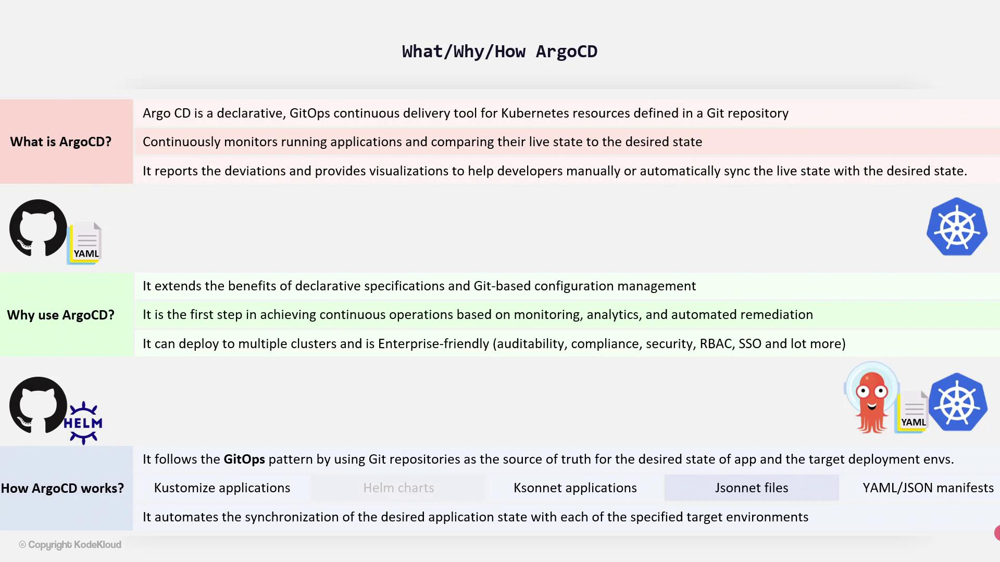
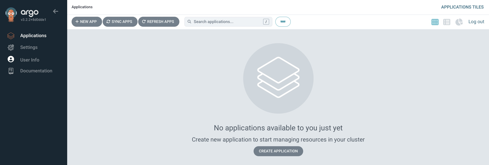
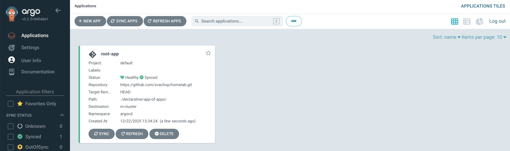
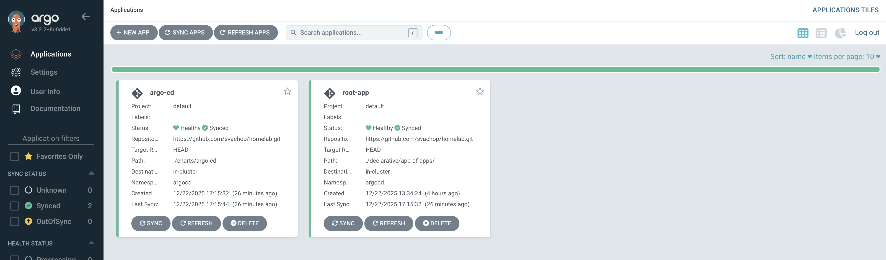

# ArgoCD Installation on Kubernetes


## Table of Contents

* [What is ArgoCD?](#what-is-argocd)
* [How Does ArgoCD Work?](#how-does-argocd-work)
* [Prerequisites](#prerequisites)
* [Creating a custom Helm chart](#creating-a-custom-helm-chart)
* [Installing our Helm chart](#installing-our-helm-chart)
* [Accessing the ArgoCD Dashboard](#accessing-the-argocd-dashboard)
* [App of Apps](#app-of-apps)
    * [Benefits of the App-of-Apps Pattern](#benefits-of-the-app-of-apps-pattern)
    * [root-app](#root-app)
    * [Creating the root-app manifest](#creating-the-root-app-manifest)
* [Let Argo CD manage itself](#let-argo-cd-manage-itself)
* [Deploying First Application with ArgoCD](#deploying-first-application-with-argocd)

---

## What is ArgoCD?

ArgoCD is a GitOps continuous delivery tool designed for Kubernetes. It treats a Git repository as the single source of truth for your desired application state. By continuously monitoring running applications, ArgoCD compares the current state with the desired state stored in Git. When discrepancies occur, it not only flags these differences but also provides visual insights, allowing developers to synchronize the live state with the desired configuration either manually or automatically.

ArgoCD simplifies Kubernetes resource management by ensuring that your application's live state always reflects the configuration defined in your Git repository.

## How Does ArgoCD Work?

ArgoCD adheres to the GitOps model by using Git repositories as the authority for both your application’s desired state and its target deployment environment. This transparent and consistent approach makes deployment processes reliable and easily auditable.
ArgoCD supports a variety of Kubernetes manifests. Whether you work with customized applications, Helm charts, JSON files, or YAML configurations, ArgoCD automates the synchronization process to ensure that deployed application states across all target environments are always aligned with those defined in Git.



## Prerequisites

List all the software, tools, or dependencies required to run the project.

```bash
brew install git
brew install gh
brew install helm
```

<p align="right">(<a href="#table-of-contents">back to top</a>)</p>

## Creating a custom Helm chart

We'll use Helm to install Argo CD with the community-maintained chart from [argoproj/argo-helm](https://github.com/argoproj/argo-helm/tree/main/charts/argo-cd). The Argo project doesn't provide an official Helm chart.

Specifically, we are going to create a Helm "umbrella chart". This is basically a custom chart that wraps another chart. It pulls the original chart in as a dependency, and overrides the default values. In our case, we create an argo-cd Helm chart that wraps the community-maintained argo-cd Helm chart.

Using this approach, we have more flexibility in the future, by possibly including additional Kubernetes resources. The most common use case for this is to add Secrets (which could be encrypted using 1Password in my case) to our application. For example, if we use webhooks with Argo CD, we have the possibility to securely store the webhook URL in a Secret.

To create the umbrella chart, we make a directory in our Git repository:

```bash
$ pwd
/Users/svachop/git/homelab
$ mkdir -p charts/argo-cd
```

Then place a Chart.yaml file in it:

[charts/argo-cd/Chart.yaml](https://github.com/svachop/homelab/blob/main/charts/argo-cd/Chart.yaml)


```YAML
apiVersion: v2
appVersion: v3.2.2
description: A Helm "umbrella chart" for Argo CD, a declarative, GitOps continuous delivery tool for Kubernetes.
name: argo-cd
version: 1.0.0
dependencies:
  - name: argo-cd
    version: 9.1.9
    repository: https://argoproj.github.io/argo-helm
```

The version of our custom chart doesn't matter and can stay the same. The version of the dependency matters and if you want to upgrade the chart, would be the place to do it. The important thing is that we pull in the community-maintained argo-cd chart as a dependency. Next, create a values.yaml file for our chart:

[charts/argo-cd/values.yaml](https://github.com/svachop/homelab/blob/main/charts/argo-cd/values.yaml)

To override the chart values of a dependency, we have to place them under the dependency name. Since our dependency in the Chart.yaml is called **argo-cd**, we have to place our values under the **argo-cd**: key. If the dependency name would be **abcd**, we'd place the values under the **abcd**: key.

All available options for the Argo CD Helm chart can be found in the [values.yaml](https://github.com/argoproj/argo-helm/blob/main/charts/argo-cd/values.yaml) file.

Before we install our chart, we need to generate a Helm chart lock file for it. When installing a Helm chart, Argo CD checks the lock file for any dependencies and downloads them. Not having the lock file will result in an error.

```bash
$ cd /Users/svachop/git/homelab/charts
$ helm repo list
$ helm repo add argo-cd https://argoproj.github.io/argo-helm
$ helm dep update argo-cd/
$ helm repo update
```

This will create the Chart.lock and charts/argo-cd-\<version\>.tgz files. The .tgz file is only required for the initial installation from our local machine. To avoid accidentally committing it, we can add it to the .gitignore file:

```bash
$ cd /Users/svachop/git/homelab
echo "charts/argo-cd/**/charts/" >> .gitignore
echo ".DS_Store" >> ~/.gitignore_global
git config --global core.excludesfile ~/.gitignore_global
```

Our custom chart is ready and can be pushed to our public Git repository:

```bash
$ cd /Users/svachop/git/homelab
$ git add .
$ git commit -m 'add argo-cd chart + documentation'
$ git push
```

The next step is to install our chart.

<p align="right">(<a href="#table-of-contents">back to top</a>)</p>

## Installing our Helm chart

We have to do the initial installation manually from our local machine, later we set up Argo CD to manage itself (meaning that Argo CD will automatically detect any changes to the helm chart and synchronize it):

```bash
$ cd /Users/svachop/git/homelab
$ helm install argo-cd charts/argo-cd/ --namespace argocd --create-namespace
```

Once installation is completed we should see following output and all resources:

```bash
NAME: argo-cd
LAST DEPLOYED: Sun Dec 21 17:01:23 2025
NAMESPACE: argocd
STATUS: deployed
REVISION: 1
DESCRIPTION: Install complete
TEST SUITE: None
```

```bash
$ kubectl -n argocd get all
NAME                                                           READY   STATUS    RESTARTS        AGE
pod/argo-cd-argocd-application-controller-0                    1/1     Running   0               5m22s
pod/argo-cd-argocd-applicationset-controller-59cb78ffd-qprlj   1/1     Running   0               5m22s
pod/argo-cd-argocd-dex-server-f5f9c7c78-8j8b2                  1/1     Running   1 (5m20s ago)   5m22s
pod/argo-cd-argocd-notifications-controller-65449c8486-xwz4c   1/1     Running   0               5m22s
pod/argo-cd-argocd-redis-7647c8776f-9hl82                      1/1     Running   0               5m22s
pod/argo-cd-argocd-repo-server-ddfd44659-5wpkj                 1/1     Running   0               5m22s
pod/argo-cd-argocd-server-675fd4497c-n2bbq                     1/1     Running   0               5m22s

NAME                                               TYPE        CLUSTER-IP       EXTERNAL-IP   PORT(S)                      AGE
service/argo-cd-argocd-applicationset-controller   ClusterIP   10.107.46.199    <none>        7000/TCP                     5m22s
service/argo-cd-argocd-dex-server                  ClusterIP   10.101.194.135   <none>        5556/TCP,5557/TCP            5m22s
service/argo-cd-argocd-redis                       ClusterIP   10.100.113.41    <none>        6379/TCP                     5m22s
service/argo-cd-argocd-repo-server                 ClusterIP   10.102.180.251   <none>        8081/TCP                     5m22s
service/argo-cd-argocd-server                      NodePort    10.111.6.118     <none>        80:30080/TCP,443:30443/TCP   5m22s

NAME                                                       READY   UP-TO-DATE   AVAILABLE   AGE
deployment.apps/argo-cd-argocd-applicationset-controller   1/1     1            1           5m22s
deployment.apps/argo-cd-argocd-dex-server                  1/1     1            1           5m22s
deployment.apps/argo-cd-argocd-notifications-controller    1/1     1            1           5m22s
deployment.apps/argo-cd-argocd-redis                       1/1     1            1           5m22s
deployment.apps/argo-cd-argocd-repo-server                 1/1     1            1           5m22s
deployment.apps/argo-cd-argocd-server                      1/1     1            1           5m22s

NAME                                                                 DESIRED   CURRENT   READY   AGE
replicaset.apps/argo-cd-argocd-applicationset-controller-59cb78ffd   1         1         1       5m22s
replicaset.apps/argo-cd-argocd-dex-server-f5f9c7c78                  1         1         1       5m22s
replicaset.apps/argo-cd-argocd-notifications-controller-65449c8486   1         1         1       5m22s
replicaset.apps/argo-cd-argocd-redis-7647c8776f                      1         1         1       5m22s
replicaset.apps/argo-cd-argocd-repo-server-ddfd44659                 1         1         1       5m22s
replicaset.apps/argo-cd-argocd-server-675fd4497c                     1         1         1       5m22s

NAME                                                     READY   AGE
statefulset.apps/argo-cd-argocd-application-controller   1/1     5m22s
```

<p align="right">(<a href="#table-of-contents">back to top</a>)</p>

## Accessing the ArgoCD Dashboard

To access the Web UI we need to use IP adress of our k8s cluster and port on service/argo-cd-argocd-server is listening. The default username is **admin** and the password is auto-generated and stored in secret **argocd-initial-admin-secret**. We can get the password with:

```bash
$ kubectl -n argocd get secret argocd-initial-admin-secret -o jsonpath="{.data.password}" | base64 -d; echo
```

After logging in, we'll see the empty Web UI:



At this point, Argo CD applications could be added through the Web UI or CLI, but we want to manage everything in a declarative way (Infrastructure as code). This means need to write Application manifests in YAML, and commit them to our Git repo.

<p align="right">(<a href="#table-of-contents">back to top</a>)</p>

## App of Apps

App-of-Apps pattern in ArgoCD is declarative approach that streamlines the creation and management of ArgoCD applications. Instead of manually deploying each application, the App-of-Apps pattern programmatically generates and manages multiple ArgoCD applications from a single root configuration.

The core idea is to create a root ArgoCD application whose source points to a folder containing YAML definition files for each microservice or application. Each YAML file specifies a path to a directory containing the relevant Kubernetes manifests. Once all these configuration files are committed to a Git repository, ArgoCD automatically detects and deploys the defined applications.

The root application acts as an orchestrator. It cues ArgoCD to traverse the specified directory, reading every YAML file to instantiate the associated applications. This ensures that updates in your Git repository trigger automatic synchronization with your Kubernetes cluster.

### Benefits of the App-of-Apps Pattern

* **Centralized Control** - Manage multiple applications from a single ArgoCD application.
* **Automated Synchronization** - Automatically detect and deploy changes from your Git repository to your Kubernetes cluster.
* **Scalable Management** - Easily add or update applications without manual intervention on each deployment.

### root-app

In general, when we want to add an application to Argo CD, we need to add an Application resource in our Kubernetes cluster. The resource needs to specify where to find manifests for our application. These manifest can either be YAML files, a Helm chart, Kustomize or Jsonnet.

For example, if we wanted to deploy Prometheus (which we will do later), we would write a Application YAML manifest for it, and put it in our Git repository. It would specify the URL to the Prometheus Helm-Chart, and override values to customize it. We would then apply the manifest and wait for the resources to be created in the cluster.

The easiest way to apply the manifest is with the kubectl CLI. However, it's a manual step that's error-prone, insecure, and we need to repeat it every time we add or update applications. With Argo CD there is a better way to handle this. We can automate adding/updating applications by creating an Application that implements the app of apps pattern. In this tutorial, we'll call this the "root-app".

The root-app is manifests file. Initially it has to be added manually, but after that we can just commit Application manifests with Git, and they will be deployed automatically.

To show how this works in more detail, we'll create the root-app next.

### Creating the root-app manifest

We create the Application manifest for our root-app in declarative/root-app/root-app.yaml.

```bash
$ cd /Users/svachop/git/homelab
$ mkdir -p declarative/root-app
$ mkdir -p declarative/app-of-apps
$ touch declarative/app-of-apps/1.yaml
```

[declarative/root-app/root-app.yaml](https://github.com/svachop/homelab/blob/main/declarative/root-app/root-app.yaml)

```YAML
apiVersion: argoproj.io/v1alpha1
kind: Application
metadata:
  name: root-app
  namespace: argocd
  finalizers:
  - resources-finalizer.argocd.argoproj.io
spec:
  project: default
  source:
    repoURL: https://github.com/svachop/homelab.git
    path: ./declarative/app-of-apps/
    targetRevision: HEAD
  destination:
    server: https://kubernetes.default.svc
    namespace: argocd
  syncPolicy:
    automated:
      prune: true
      selfHeal: true
```

We push the files to our Git repository:

```bash
$ git add declarative/root-app
$ git commit -m 'add root-app'
$ git push
```

And then apply the manifest in our Kubernetes cluster. The first time we have to do it manually, later we'll let Argo CD manage the root-app and synchronize it automatically:

```bash
$ cd /Users/svachop/git/homelab/declarative/root-app
$ kubectl apply -f root-app.yaml
```

In the Web UI and kubernetes cluster we can now see that the root-app was created:

```bash
$ kubectl -n argocd get application
NAME       SYNC STATUS   HEALTH STATUS
root-app   Synced        Healthy
```



<p align="right">(<a href="#table-of-contents">back to top</a>)</p>

## Let Argo CD manage itself

We previously installed Argo CD manually by running helm install from our local machine. This means that updates to Argo CD, like upgrading the chart version or changing the **values.yaml**, require us to execute the Helm CLI command from a local machine again. It's repetitive, error-prone and inconsistent with how we install other applications in our cluster.

The solution is to let Argo CD manage Argo CD. To be more specific: We let the Argo CD controller watch for changes to the argo-cd helm chart in our repo (under **charts/argo-cd**), render the Helm chart, and apply the resulting manifests. It's done using kubectl and asynchronous, so it is safe for Kubernetes to restart the Argo CD Pods after it has been executed.

To achieve this, we need to create an Application manifest that points to our Argo CD chart. We'll use the same chart version and values file as with our previous manual installation, so initially there won't be any changes made to the resources in the cluster.

The application manifest looks like this:

[declarative/app-of-apps/argo-cd.yaml](https://github.com/svachop/homelab/blob/main/declarative/app-of-apps/argo-cd.yaml)

```YAML
apiVersion: argoproj.io/v1alpha1
kind: Application
metadata:
  name: argo-cd
  namespace: argocd
  finalizers:
  - resources-finalizer.argocd.argoproj.io
spec:
  project: default
  source:
    repoURL: https://github.com/svachop/homelab.git
    path: ./charts/argo-cd
    targetRevision: HEAD
  destination:
    server: https://kubernetes.default.svc
    namespace: argocd
  syncPolicy:
    automated:
      selfHeal: true
```
We can commit and push the application manifest to our Git repository. 

In the Web UI we should now see the root-app being OutOfSync, and then changing to Syncing. If it doesn't show the changes right away, it's probably due to the default change detection polling rate of 3 minutes. We can speed this up by clicking on the Refresh button on the root-app which triggers a manual sync.

For faster change detection look into setting up [webhooks](https://argo-cd.readthedocs.io/en/stable/operator-manual/webhook/), these will trigger a sync immediately after pushing to the Git repo.



Once the Argo CD application is green (synced) we're done. We can make changes to our Argo CD installation the same way we change other applications: by changing the files in the repo and pushing it to our Git repository.

<p align="right">(<a href="#table-of-contents">back to top</a>)</p>
